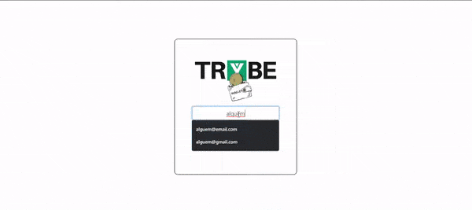
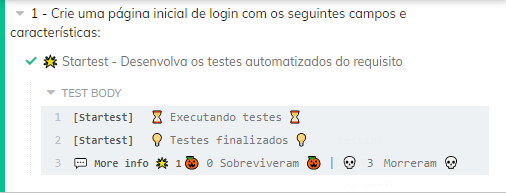
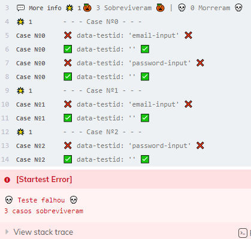
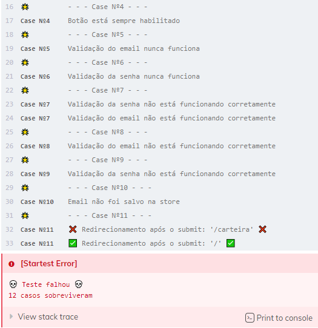

# Welcome to the Trybewallet project repository!

### README Translations:

-   [English](/README.en.md)
-   [Portuguese](/README.md)

* * *

## 👨‍💻 What was developed:

-   In this project I developed a wallet to control expenses with a currency converter, when using this application a user should be able to:

    -   Add, remove and edit an expense;
    -   View a tables with your expenses;
    -   View total spend converted to a currency of choice;

:bulb:**See a sample below:**


## Skills used:

-   Create one_store_Redux in React Applications

-   Create_reducers_in Redux in React applications

-   Create_actions_in Redux in React applications

-   Create_dispatchers_in Redux in React applications

-   Connect Redux to React components

-   Create_actions_asynchronous in your React application that makes use of Redux.

# requirements

* * *

## Login Page

Create a page for the user to identify themselves, with email and password. This page should be your application's home page.

<details><summary> Página de Login</summary>



</details><br />

## 1. Create a login homepage with the following fields and characteristics

-   The route to this page must be`/`;

-   <details><summary> Você deve criar um local para que a pessoa usuária insira seu e-mail e senha:</summary>

    -   The field for the email must have the attribute`data-testid="email-input"`;
    -   The email must be in a valid format, such as '[alguem@alguem.com](mailto:alguem@alguem.com)';
    -   The field for the password must have the attribute`data-testid="password-input"`;
    -   The password must be 6 or more characters long.
        </details>

-   <details><summary> Crie um botão com o texto <code>Entrar</code>:</summary>

    -   The button must be**disabled**if the email does not have a valid format or the password is shorter than 6 characters;

    -   Save the email in the global state of the application, with the key**_email_**, as soon as the user_camp_;

    -   The route must be changed to`/carteira`after clicking the '**Log in**'.
        </details>

<br />
<details><summary><strong>O que será verificado</strong></summary><br />

-   The route to this page is`"/"`
-   An element is rendered for the user to enter their email and password
-   A button with the text is rendered`"Entrar"`
-   <details><summary> Foram realizadas as seguintes verificações nos campos de email, senha e botão:</summary>

    -   It is an email in valid format;
    -   The password is 6 or more characters long;
    -   disable the button`Entrar`if email and/or password are in invalid format
    -   Enable the button`Entrar`if email and password are valid
        </details><br />
-   Save the email in the application state, with the email key, as soon as the user logs in
-   The route is changed to`"/carteira"`after clicking the button
    </details>

* * *

## Portfolio Page

Create a page to manage the portfolio of expenses in different currencies and that brings the total expense in reais, which is represented by the code 'BRL'. This page must be rendered by a component called**_Wallet_**.

-   The route to this page must be`/carteira`;

<details><summary> Página da carteira:</summary>
  
  
</details><br />

* * *

## Header

## 2. Create a header for the wallet page containing the following characteristics

-   the component`Header`must be rendered inside the component[`Wallet`](#página-da-carteira);


-   <details><summary> Um elemento que exiba o e-mail da pessoa usuária que fez login:</summary>

    -   add the attribute`data-testid="email-field"`.

    -   :bulb:**Tip**: you must get the e-mail of the global state of the application (in Redux).
        </details>

-   <details><summary> Um elemento com a despesa total gerada pela lista de gastos:</summary>

    -   add the attribute`data-testid="total-field"`in this element;

    -   Initially this element should display the value`0`;
        </details>

-   <details><summary> Um elemento que mostre qual câmbio está sendo utilizado, que neste caso será 'BRL':</summary>

    -   add the attribute`data-testid="header-currency-field"`in this element
        </details><br />

<details>
  <summary><strong>O que será verificado</strong></summary>

-   The element with the`data-testid="email-field"`renders the email saved in the global state.
-   The element with the`data-testid="total-field"`initially renders the value`0`.
-   The element with the`data-testid="header-currency-field`render the text`BRL`.
    </details>

* * *

## 3. Develop a form to add an expense containing the following characteristics:

-   the component`WalletForm`must be rendered inside the component[`Wallet`](#página-da-carteira);

-   <details><summary> Um campo para adicionar valor da despesa:</summary>

    -   add the attribute`data-testid="value-input"`.
        </details>

-   <details><summary> Um campo para adicionar a descrição da despesa:</summary>

    -   add the attribute`data-testid="description-input"`.
        </details>

-   <details><summary> Um campo para selecionar em qual moeda será registrada a despesa.</summary>

    -   The field must be a`<select>`.
    -   add the attribute`data-testid="currency-input"`.
    -   Options must be filled by the key value`currencies`of the global state.
        -   The key values<code>currencies</code>in the global state must be pulled through an API request on the endpoint`https://economia.awesomeapi.com.br/json/all`;
        -   Remove, from the information brought by the API, the 'USDT' option;
        -   A chave`currencies`of the global state must be an array.

</details>

-   <details><summary> Um campo para adicionar qual método de pagamento será utilizado.</summary>

    -   This field must be a`<select>`.
    -   add the attribute`data-testid="method-input"`.
    -   The user must be able to choose between the fields: 'Money', 'Credit card' and 'Debit card'.
        </details>

-   <details><summary> Um campo para selecionar uma categoria (tag) para a despesa.</summary>

    -   The field must be a`<select>`.
    -   add the attribute`data-testid="tag-input"`.
    -   This field must be a dropdown. the user must be able to choose between the fields: 'Food', 'Leisure', 'Work', 'Transport' and 'Health'.

</details>

<details>
  <summary><strong>Observações Importantes:</strong></summary><br />

Note that the fields`<select>`already start with a value selected in your browser. You can also check via`React Developer Tools`that the state of your component initializes in sync with what is displayed in the browser.

To illustrate, imagine that the initial state is an empty string. In this case the user can easily cause a problem where he believes the option is already selected (since the select shows a value), when in fact it is not yet (the state was initialized with an empty string). For this reason it is important to synchronize the same initial value of the`<select>`in its state in react, rather than initializing with an empty string.

</details>

<br />

<details><summary> Ilustração do formulário</summary>


</details><br />

<details>
  <summary><strong>O que será verificado</strong></summary>

-   The field to add the expense amount has the`data-testid="value-input"`.
-   The field to add the expense description has the`data-testid="description-input"`.
-   The field to select in which currency the expense will be registered has the`data-testid="currency-input"`.
    -   The API is called with the endpoint`https://economia.awesomeapi.com.br/json/all`
    -   the key value`currencies`in the global state is an array that has the acronyms of the currencies that came from the API.
    -   The field to select in which currency the expense will be registered has options with the same values ​​as the array located in the currencies key of the global state.
-   The field to select which payment method will be used has the`data-testid="method-input"`.
-   The field to select which payment method will be used has options with the values`Dinheiro`,`Cartão de crédito`e`Cartão de débito`.
-   The field to select an expense category (tag) has the`data-testid="tag-input"`
-   The field to select a category (tag) of the expense has options with the values`Alimentação`,`Lazer`,`Trabalho`,`Transporte`e`Saúde`.
    </details>

* * *

## 4. Save all form information in global state

-   Create a button with the text \\'Add expense\\'. It will serve to save the expense information in the global state and update the sum of expenses in the header.

-   <details><summary> Desenvolva a funcionalidade do botão "Adicionar despesa" de modo que, ao clicar no botão, as seguintes ações sejam executadas:</summary>

    -   <details><summary> Os valores dos campos devem ser salvos no estado da aplicação, na chave <b><i>expenses</i></b>, dentro de um array contendo todos gastos que serão adicionados:</summary>

        -   O`id`of expense**he must**be a sequential number, starting at 0. That is: the first expense will have id 0, the second will have id 1, the third id 2, and so on.
        -   :bulb:**Attention at this point**: you must make a request to the API and get the quote at the moment that the button of`Adicionar despesa`is tight. For this you can use a thunk.
            -   **You must save the exchange rate made at the time of adding**that will be needed to edit the expense (requirement 8). If you do not have this information saved, the value of the quote brought in may be different from that obtained previously.

        </details>

    -   <details><summary> Após adicionar a despesa:</summary>

        -   Update the total sum of expenses (use the key`ask`to make this sum). This information must be in the[`header`](#2-crie-uma-página-para-sua-carteira-com-as-seguintes-características)inside the element with`data-testid="total-field"`;
            -   The element with the testid should only contain the sum total of expenses.
            -   The total amount must be displayed to 2 decimal places. Example: (value - point - two decimal places)`100.00``23.50`

        -   Clear the value and description inputs.
            </details>

    -   <details><summary> As despesas salvas no Redux ficarão com um formato semelhante ao seguinte:</summary>

              ```javascript
              expenses: [{
                "id": 0,
                "value": "3",
                "description": "Hot Dog",
                "currency": "USD",
                "method": "Dinheiro",
                "tag": "Alimentação",
                "exchangeRates": {
                  "USD": {
                    "code": "USD",
                    "name": "Dólar Comercial",
                    "ask": "5.6208",
                    ...
                  },
                  "CAD": {
                    "code": "CAD",
                    "name": "Dólar Canadense",
                    "ask": "4.2313",
                    ...
                  },
                  "EUR": {
                    "code": "EUR",
                    "name": "Euro",
                    "ask": "6.6112",
                    ...
                  },
                  "GBP": {
                    "code": "GBP",
                    "name": "Libra Esterlina",
                    "ask": "7.2498",
                    ...
                  },
                  "ARS": {
                    "code": "ARS",
                    "name": "Peso Argentino",
                    "ask": "0.0729",
                    ...
                  },
                  "BTC": {
                    "code": "BTC",
                    "name": "Bitcoin",
                    "ask": "60299",
                    ...
                  },
                  "LTC": {
                    "code": "LTC",
                    "name": "Litecoin",
                    "ask": "261.69",
                    ...
                  },
                  "JPY": {
                    "code": "JPY",
                    "name": "Iene Japonês",
                    "ask": "0.05301",
                    ...
                  },
                  "CHF": {
                    "code": "CHF",
                    "name": "Franco Suíço",
                    "ask": "6.1297",
                    ...
                  },
                  "AUD": {
                    "code": "AUD",
                    "name": "Dólar Australiano",
                    "ask": "4.0124",
                    ...
                  },
                  "CNY": {
                    "code": "CNY",
                    "name": "Yuan Chinês",
                    "ask": "0.8278",
                    ...
                  },
                  "ILS": {
                    "code": "ILS",
                    "name": "Novo Shekel Israelense",
                    "ask": "1.6514",
                    ...
                  },
                  "ETH": {
                    "code": "ETH",
                    "name": "Ethereum",
                    "ask": "5184",
                    ...
                  },
                  "XRP": {
                    "code": "XRP",
                    "name": "Ripple",
                    "ask": "1.4",
                    ...
                  }
                }
              }]
              ```
            </details>

        </details><br />
        <details>
          <summary><strong>O que será verificado</strong></summary>

    -   A button with the text "Add Expense" is rendered.

    -   By clicking on the "Add Expense" button
            - é feita uma requisição a API
            - é salva uma nova despesa na chave `expenses` do estado global
            - o valor total do elemento com o `data-testid="total-field"` é atualizado.
            - cada despesa possui um id sequencial.
            - os inputs de valor e descrição voltam ao valor inicial, contendo o valor `""`
            - é exibido o total das despesas com 2 casas decimais no elemento com o `data-testid="total-field"`, levando em consideração a cotação localizada na chave `ask`.
        </details>

* * *

## 5. Develop tests to achieve 60% full application coverage

<details>
<summary><strong>Observações técnicas</strong></summary><br />

-   The tests you create will not influence the other requirements in the evaluator. You will develop your unit/integration tests using the React Testing Library, while the evaluator will use the library[Cypress](https://docs.cypress.io/)to assess requirements, including coverage requirements.
-   If in doubt, read the section<a href="#testes">Tests > Execution of Coverage Test</a>.

</details>

<details>
<summary><strong>O que será avaliado</strong></summary><br />

-   It will be validated if when executing`npm run test-coverage`the following results are obtained:
        * `% Stmts` da linha `All files` é maior ou igual a 60.
        * `% Branch` da linha `All files` é maior ou igual a 60.
        * `% Funcs` da linha `All files` é maior ou igual a 60.
        * `% Lines` da linha `All files` é maior ou igual a 60.
    </details>

* * *

## Table of Expenses

## 6. Develop a table with expenses containing the following characteristics:

-   the component`Table`must be rendered inside the component[`Wallet`](#página-da-carteira);


-   <details><summary> A tabela deve possuir um cabeçalho com os seguintes valores:</summary>

        - Descrição;
        - Tag;
        - Método de pagamento;
        - Valor;
        - Moeda;
        - Câmbio utilizado;
        - Valor convertido;
        - Moeda de conversão;
        - Editar/Excluir.

    </details><br />

<details>
  <summary><strong>O que será verificado</strong></summary>

-   The table has a header with elements`<th>` com os valores `Descrição`,`Tag`,`Método de pagamento`,`Valor`,`Moeda`,`Câmbio utilizado`,`Valor convertido`,`Moeda de conversão`e`Editar/Excluir`.
    </details>

* * *

## 7. Implement the logic so that the table is fed by the application state

-   <details><summary> A tabela deve ser alimentada pelo estado da aplicação, que estará disponível na chave <b><i>expenses</i></b> que vem do <i>reducer</i> <code>wallet</code>:</summary>

    -   the field of`Moeda`must contain the name of the currency. Therefore, instead of 'USD' or 'EUR', it should contain "US Dollar/Brazilian Real" and "Euro/Brazilian Real", respectively;

    -   The element that displays the`Moeda de conversão`must always be 'Real';

    -   Also pay attention to the decimal places of the fields. As they are book values, they must show two places after the dot. Round your answer only when rendering the result and, for calculations, always use the values ​​coming from the API (use the field`ask`that comes from the API).

    -   Always use the format`0.00`(number - dot - two decimal places).
        </details><br />

<details>
  <summary><strong>O que será verificado</strong></summary>

-   The table is updated with the information coming from the key`expense`of the global state.
-   The table has a body with one element`<tr>`for each expense.
-   the element`<tr>`has elements`<td>`com`Descrição`,`Tag`,`Método de pagamento`,`Valor`,`Moeda`,`Câmbio utilizado`,`Valor convertido`,`Moeda de conversão`of each expense.
    </details>

* * *

## 8. Create a button to delete an expense from the table containing the following characteristics:

<details><summary> Ilustração do botão</summary>


</details>

-   The button must be the last item in the table row and must have the attribute`data-testid="delete-btn"`.

-   After the button is clicked, the following actions should take place:
    -   The expense must be deleted from the global status
    -   The expense will no longer be displayed in the table
    -   The total value displayed in the header will change.

<br /><details>

  <summary><strong>O que será verificado</strong></summary>

-   The button is on the last element`<td>`of each element`<tr>`.
-   The button has`data-testid="delete-btn"`.
-   By clicking on the button, the expense is removed from the global state and consequently from the table.
-   By clicking on the button, the total expense is updated in the header, subtracting the corresponding amount.
    </details>

* * *

## 9. Create a button to edit a table expense containing the following characteristics:

<details><summary> Ilustração do botão</summary>


</details>

-   The button must be inside the last item of the table row and must have`data-testid="edit-btn"`

-   <details><summary> Ao ser clicado, o botão habilita um formulário para editar a linha da tabela. Ao clicar em "Editar despesa" ela é atualizada, alterando o estado global.</summary>

    -   The form must have the same`data-testid`of the add expense form. You can reuse it.

    -   The button to submit the expense for editing must contain**exactly**the text "Edit expense"

    -   After editing the expense, the order of expenses in the table needs to be maintained.

    -   :bulb:**Obs**: for this requirement, it is not necessary to populate the inputs with the previous values ​​of the expense. The gif image is just a suggestion.

    -   :bulb: Remember to use the global application state format informed in the section<a href="#como-desenvolver">Development</a>

    -   **Heads up**: the exchange rate used in the edition must be the same as the calculation made when adding the expense.
        </details><br />

<details>
  <summary><strong>O que será verificado</strong></summary>

-   The button is on the last element`<td>`of each element`<tr>`.
-   The button has`data-testid="edit-btn"`.
-   When clicked, the addition form becomes an edit form.
-   When clicked, the button with the text`"Adicionar Despesa"`is changed to`"Editar despesa"`.
-   After editing an expense the key`expenses`in the global state is updated with the new value.
-   The order of expenses is maintained after editing.
-   The value in the field with the`data-testid="total-field"`is updated after editing an expense.
    </details>

## 10. Develop tests to achieve 90% full application coverage

<details>
<summary><strong>Observações técnicas</strong></summary><br />

-   The tests you create will not influence the other requirements in the evaluator. You will develop your unit/integration tests using the React Testing Library, while the evaluator will use the library[Cypress](https://docs.cypress.io/)to assess requirements, including coverage requirements.
-   If in doubt, read the section<a href="#testes">Tests > Execution of Coverage Test</a>.

</details>

<details>
<summary><strong>O que será avaliado</strong></summary><br />

-   It will be validated if when executing`npm run test-coverage`the following results are obtained:
        * `% Stmts` da linha `All files` é maior ou igual a 90.
        * `% Branch` da linha `All files` é maior ou igual a 90.
        * `% Funcs` da linha `All files` é maior ou igual a 90.
        * `% Lines` da linha `All files` é maior ou igual a 90.
    </details>

# Startest Secret Requirements (non-evaluative)

The requirements below will not be evaluated by the evaluator, however you can execute them, all of them are in the folder`cypress/integration/secrets`.

## 🌟 Props Startest

-   <details><summary>Como desenvolver e o que é Startest</summary><br />

    This project has special requirements called requirements.`Startest`, to complete a Startest requirement, in addition to developing what is requested in the requirement, you must also develop automated tests using the library[React Testing Library](https://testing-library.com/docs/react-testing-library/intro)who must verify the same points requested in the requirement.

    To assist in the development of your tests the folder`tests/helpers`, includes tools such as`mockData`e`renderWithRouterAndRedux`.

    An example of the Startest requirement:

        X. Crie uma página de login
        🌟 [Requisito Startest] 🌟
          A página deverá conter:
            - Um campo de email com o atributo data-testid="email-input"
            - Um campo de senha com o atributo data-testid="password-input"

    In this case, in addition to developing the login page with its respective elements, you must develop tests to also verify these same data-testid and its elements.**As you can see, this is an excellent opportunity to put the TDD concept into practice!**

    Startest requirements will require some specific settings**pay attention to the instructions of each requirement!!**Example:

        X. Crie uma página de login
        🌟 [Requisito Startest] 🌟
          O componente da página deverá se encontrar em "src/pages/Login" ou "src/pages/Login/index"
          O arquivo de teste deverá se chamar "X.star.test.js"
          /* ... */

    It is important to note that the tests in this file must have the same scope of the requirement, that is, you must test only what was developed in the requirement. If you want to test something outside the scope of the requirement you must use another file.

    Keep in mind that there will be requests in some requirements, in all these requirements it is important to use a mock to ensure better performance and greater reliability of your tests.

    **The mock of the request must be done in the method`fetch`do`window`!**In addition, the mock must be performed within a`beforeEach`or inside each`it`/`test`.

    The Startest requirement runs like any other cypress test requirement, more information in the<a href="#testes">Testes</a>.

-   <details><summary>Como funcionam os test cases Startest</summary><br />

    Startest works as follows for each requirement:

    In the initial phase your test is run once with your original component and once with a fake component without any modification.

    -   Expected that all tests with the original component`passem`no problems.
    -   Expected that all tests with the false component`passem`no problem, the fake component only relies on what is asked for in the requirement, so the test can also fail if you try to test something outside the scope of the requirement.

    <br/>
    Após a fase inicial o seu teste será executado apenas com o componente falso, e a cada test case esse componente falso irá ser modificado e pode se comportar de uma maneira diferente, sendo esperado que ele <code>falhe</code> em todos test cases.

    <br/>
    Seguindo então o exemplo

          X. Crie uma página de login
          🌟 [Requisito Startest] 🌟
            A página deverá conter:
              - Um campo de email com o atributo data-testid="email-input"
              - Um campo de senha com o atributo data-testid="password-input"

    The fake component will have three test cases, where the fake component will display:

    1.  The two inputs with their empty data-testids.
        -   Hope your test`falhe`for lack of testId in**both inputs**.
    2.  just the input of**password**with the testId empty.
        -   Hope your test`falhe`by default do testId no**input de password**.
    3.  just the input of**email**with the testId empty.
        -   Hope your test`falhe`by default do testId no**input de email**.

    <br/>
    Caso seu teste falhe em todos os casos acima, significa que você está testando corretamente tudo o que foi pedido no requisito! Logo você passará no requisito Startest e uma mensagem como essa será exibida:

    

    If your test passes a test case without failing, this message will be displayed with information for each case that survived, telling you what you didn't test about the requirement. (The ❌ indicates what the original value was and the ✅ indicates the value that the test case entered)

    

    > Note that in cases like test Case Nº0, where the false component displayed both inputs without any testId, the messages can be repeated later by the other cases that modify only one input.

    Of course, we won't always be just testing data-testids and in Startest it's no different, there are cases that will modify the behavior of the false component, in these cases you can see messages like these:

    

    In this case the message "Password validation is not working correctly"**It does NOT mean that your component is not validating the password**and yes that you are not correctly testing the password validation in your tests, knowing this and using the readme, you can check how the validation is requested in the requirement to understand how you should test it.

</details>

> Numbered requirements against which original requirements are to be tested.
>
> Depending on the requirement, the tests may take a while to run.

<details><summary>1. Desenvolva os testes automatizados do Login</summary>

-   You will have to develop tests that will verify everything that is requested in the[requirement 1](#1-crie-uma-página-inicial-de-login-com-os-seguintes-campos-e-características).
-   The component must be in`src/pages/Login`
-   The test file should be called`01.star.test.js`

        <details><summary><strong>🌟 O que você deverá testar</strong></summary>

        - A rota para esta página é `"/"`
        - É renderizado um elemento para que o usuário insira seu email e senha
        - É renderizado um botão com o texto `"Entrar"`
        - Foram realizadas as seguintes verificações nos campos de email, senha e botão:
          - É um e-mail no formato válido;
          - A senha tem 6 ou mais caracteres;
          - Desabilita o botão `Entrar` caso e-mail e/ou senha estiverem no formato inválido
          - Habilita o botão `Entrar` caso e-mail e senha sejam válidos
        - Salva o email no estado da aplicação, com a chave email, assim que o usuário logar
        - A rota é alterada para `"/carteira"` após o clique no botão
        </details>
        <br />

    </details>

<details><summary>3. Desenvolva os testes automatizados do formulário de despesas</summary>

-   You will have to develop tests that will verify everything that is requested in the[requirement 3](#3-desenvolva-um-formulário-para-adicionar-uma-despesa-contendo-as-seguintes-características).
-   The component must be in`src/components/WalletForm`
-   The test file should be called`03.star.test.js`
-   Keep in mind that requests will be made in this requirement, feel free to use the mocked data in`test/helpers/mockData.js`or create your own mock.

        <details>
        <summary><strong>🌟 O que você deverá testar</strong></summary>

        - O campo para adicionar o valor da despesa possui o `data-testid="value-input"`.
        - O campo para adicionar a descrição da despesa possui o `data-testid="description-input"`.
        - O campo para selecionar em qual moeda será registrada a despesa possui o `data-testid="currency-input"`.
          - A API é chamada com o endpoint `https://economia.awesomeapi.com.br/json/all`
          - O valor da chave `currencies` no estado global é um array que possui as siglas das moedas que vieram da API.
          - O campo para selecionar em qual moeda será registrada a despesa possui options com os valores iguais ao do array localizado na chave currencies do estado global.
        - O campo para selecionar qual método de pagamento será utilizado possui o `data-testid="method-input"`.
        - O campo para selecionar qual método de pagamento será utilizado possui options com os valores `Dinheiro`, `Cartão de crédito` e `Cartão de débito`.
        - O campo para selecionar uma categoria (tag) da despesa possui o `data-testid="tag-input"`
        - O campo para selecionar uma categoria (tag) da despesa possui options com os valores `Alimentação`, `Lazer`, `Trabalho`, `Transporte` e `Saúde`.
        </details>

      <br />
    </details>

<details><summary>4. Desenvolva os testes automatizados do salvamento das despesas</summary>

-   You will have to develop tests that will verify everything that is asked for in this requirement.
-   The form component should be in`src/components/WalletForm`
-   The component of[header](#2-crie-um-header-para-a-página-de-carteira-contendo-as-seguintes-características)should meet in`src/components/Header`
-   The test file should be called`04.star.test.js`
-   Keep in mind that requests will be made in this requirement, feel free to use the mocked data in`test/helpers/mockData.js`or create your own mock.

        <details>
        <summary><strong>🌟 O que você deverá testar</strong></summary>

        - É renderizado um botão com o texto "Adicionar despesa".
        - Ao clicar no botão "Adicionar despesa"
          - é feita uma requisição a API
          - é salva uma nova despesa na chave `expenses` do estado global
          - o valor total do elemento com o `data-testid="total-field"` é atualizado.
          - cada despesa possui um id sequencial.
          - os inputs de valor e descrição voltam ao valor inicial, contendo o valor `""`
          - é exibido o total das despesas com 2 casas decimais no elemento com o `data-testid="total-field"`, levando em consideração a cotação localizada na chave `ask`.
        </details>

      <br />
    </details>

<details><summary>8. Desenvolva os testes automatizados do botão que deleta as despesas</summary>

-   You will have to develop tests that will verify everything that is requested in the[requirement 8](#8-crie-um-botão-para-deletar-uma-despesa-da-tabela-contendo-as-seguintes-características).
-   The component of[table](#tabela-de-gastos)should meet in`src/components/Table`
-   The component of[header](#2-crie-um-header-para-a-página-de-carteira-contendo-as-seguintes-características)should meet in`src/components/Header`
-   The test file should be called`08.star.test.js`

        <details><summary><strong>🌟 O que você deverá testar</strong></summary>

        - O botão se encontra no último elemento `<td>` de cada elemento `<tr>`.
        - O botão possui o `data-testid="delete-btn"`.
        - Ao clicar no botão, a despesa é removida do estado global e consequentemente da tabela.
        - Ao clicar no botão, a despesa total é atualizada no header, subtraindo o valor correspondente.
        </details>

      <br />
    </details>
